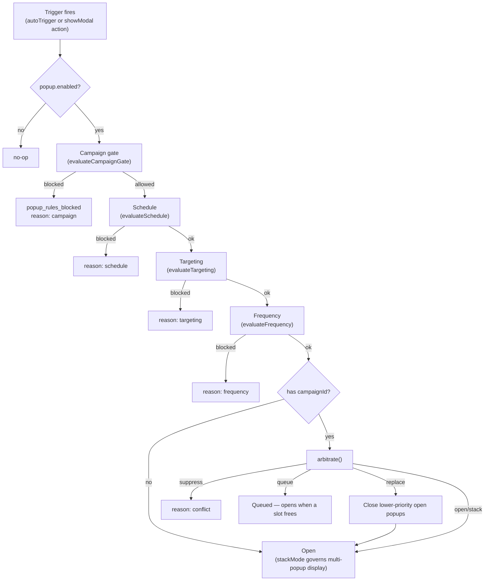

# Popups

> Audience: AI agents & maintainers. User-facing overview: [/docs/user-guide/07-popup-modal.md](../../docs/user-guide/07-popup-modal.md)

Popup system (modal / drawer / bottom sheet / bar / fullscreen) — a **document-level layer**, not a
node in the page tree. Popups are stored on `BuilderDocument.popups` / `BuilderDocument.popupCampaigns`
alongside (not inside) the page's node tree, each with its own `rootNodeId` pointing at a content
subtree the popup owns.

This is currently the largest undocumented subsystem in the codebase (schema version 2.7.0, V3→V6
additive features) — this file is the primary spec; source of truth is always
`packages/builder-core/src/document/popups.ts`.

---

## Data Model

Full type definitions: `packages/builder-core/src/document/popups.ts`. Below is the shape, not a copy
of the interface — read the source file for exact field types.

```
PopupDefinition
  id, name, enabled, rootNodeId
  kind            : "modal" | "drawer" | "bottomSheet" | "bar" | "fullscreen"
  placement       : "center" | "top" | "bottom" | "left" | "right"
  kindConfig      : discriminated union on `kind` — size/width/height/snapPoints/sticky per kind,
                    editor-time draggable/resizable vs V3 runtimeDraggable/runtimeResizable
  autoTrigger     : "manual" | "pageLoad" | "scrollDepth" | "sectionVisible"
  behavior        : backdrop, closeOnEscape/BackdropClick, showCloseButton, lockBodyScroll,
                    trapFocus, restoreFocus, V3: closeOnRouteChange/closeOnOutsideInteraction/
                    preventBackgroundInteraction/inertBackground/reducedMotion
  animation       : enter/exit ("fade"|"scale"|"slide-*"|"none"), durationMs, easing
  rules           : devices, showOncePerSession, showOnceEveryDays, maxShows, hideAfterSubmit,
                    V5: frequency, targeting, scheduling (see "Rules Evaluation" below)
  runtimeState?   : V3 stackMode ("single"|"multiple"|"replace-same-kind"), zIndexBase
  goals?          : V4 PopupGoal[] — conversion tracking (click/submit/close/customEvent/urlVisit)
  variants?       : V4 PopupVariant[] — A/B content variants (see "Content Ownership")
  experiment?     : V4 assignment config ("random"|"sticky"), winnerVariantId
  locales?        : V5 PopupLocaleContent[] — per-locale content (see "Content Ownership")
  fallbackLocale? : V5
  campaignId?     : V6 — which PopupCampaign this belongs to (absent = ungrouped)
  priority?       : V6 — arbitration weight within its campaign (default 0)
  metadata        : createdAt, updatedAt, tags?, pluginData?

BuilderDocument.popupCampaigns?: Record<string, PopupCampaign>
PopupCampaign
  id, name, status: "draft"|"review"|"published"|"paused"|"archived"
  priority?, conflictPolicy?: "queue"|"suppress"|"replace"|"stack" (default "stack")
```

Defaults for a new popup of a given `kind`: `getDefaultPopupKindConfig`, `getDefaultPopupBehavior`,
`getDefaultPopupAnimation`, `createDefaultPopupDefinition` (all in `popups.ts`).

---

## Content Ownership Rules

**The most important rule in this file — get this wrong and you corrupt or leak content across
variants/locales/duplicates.**

- A `PopupVariant` or `PopupLocaleContent` entry MAY have its own `rootNodeId` — a content subtree it
  **owns**. When it does: that subtree is cascade-deleted when the popup (or the variant/locale entry)
  is deleted, and deep-cloned when the popup is duplicated.
- When a variant/locale entry has **no** `rootNodeId`, it reuses the base popup's content and only
  applies its `popupPatch` (a `Partial` of non-identity/non-content fields). No content tree exists
  for it — nothing to own, nothing to clean up.
- `PopupVariant.popupPatch` excludes `id | rootNodeId | metadata | variants | experiment | goals`.
  `PopupLocaleContent.popupPatch` excludes `id | rootNodeId | metadata | locales | fallbackLocale |
  variants | experiment`. These exclusions exist so a patch cannot recursively redefine the very
  ownership/identity fields the content-ownership rule depends on.
- Editor's `activeRootNodeId` resolution order (see `BuilderEditor.tsx`):
  variant root → locale root → base popup root → document root. This is the same precedence a
  runtime consumer should use when resolving which content tree is "active" for a given
  variant+locale combination.

**When you change popup schema:** any new field that can hold a content-owning `rootNodeId` must be
threaded through cascade-delete and deep-clone logic, and through this precedence chain. This is the
single most common way to introduce a content-leak bug in this subsystem.

---

## Rules Evaluation (V5)

Three independent gates, each a pure function in `packages/builder-core/src/popups/rules.ts`:

| Function | Gate | Blocks when |
|----------|------|-------------|
| `evaluateSchedule(scheduling, now)` | Date/time window | Outside `startDate`/`endDate`/`timeWindow` (hour range + optional day-of-week) |
| `evaluateTargeting(targeting, context)` | Audience match | `groups` (all/any of `PopupTargetingCondition[]`) don't match `RendererConfig.popupContext` (dot-notation keys, e.g. `"user.trait.plan"`) |
| `evaluateFrequency(frequency, rules, readCount, popupId, documentId, now)` | Show-count cap | `frequency.cap` (`{ maxShows, per: "session"\|"hour"\|"day"\|"week"\|"month" }`) exceeded, reads via `RendererConfig.getFrequencyCount` (defaults to local/sessionStorage) |

`resolveLocaleContent(popup, locale)` picks the best-matching `PopupLocaleContent` for a BCP-47 locale
(exact → language-prefix → `fallbackLocale` → base content).

---

## Campaigns & Conflict Arbitration (V6)

Campaigns group popups for coordinated eligibility and mutual exclusion. Pure logic lives in
`packages/builder-core/src/popups/campaigns.ts`:

- `evaluateCampaignGate(popup, campaigns)` — a popup with `campaignId` is only eligible when its
  campaign's `status === "published"` (draft/review/paused/archived block it; a dangling/missing
  campaignId is lenient-allowed).
- `effectivePriority(popup, campaigns)` = `(campaign.priority ?? 0) * 1000 + (popup.priority ?? 0)` —
  campaign priority dominates, popup priority only breaks ties within one campaign.
- `resolveConflictPolicy(popup, campaigns)` — defaults to `"stack"` (no arbitration) when the popup
  has no campaign or the campaign specifies none.
- `arbitrate(input)` — pure decision function, called only when the popup belongs to a campaign:
  - `"stack"` → always `open` (no arbitration; runtime falls back to `runtimeState.stackMode`).
  - `"suppress"` → `open` only if `candidatePriority >= maxOpenPriority` among currently-open
    campaign popups, else `suppress`.
  - `"replace"` → close every open campaign popup with **strictly lower** priority (`>`, not `>=` —
    equal priority does not replace, to avoid thrashing) and open; if none are lower, `open` normally.
  - `"queue"` → `queue` if any campaign popup is currently open, else `open` immediately.

## Open/Close Lifecycle

`openPopup(popupId)` in `packages/builder-renderer/src/RuntimeRenderer.tsx` runs gates **in this
order** — first failure short-circuits and emits `popup_rules_blocked` with the matching
`rulesBlockReason`:



Popup **stack lifecycle** (per open popup instance) is a small state machine — `opening → open →
closing → closed` — with pure transitions in `packages/builder-core/src/popups/lifecycle.ts`; the
`RuntimeRenderer` hook owns the `setTimeout` wiring around animation durations (respecting
`prefers-reduced-motion` via `shouldReducePopupMotion`) and callback firing (`onPopupOpen`/
`onPopupClose`).

`closePopup(popupId, reason)` accepts `reason: "button" | "escape" | "backdrop" | "action" |
"routeChange" | "programmatic"` — recorded on the `popup_close` analytics event.

---

## Auto Triggers

`PopupAutoTrigger` (in `popups.ts`): `{ type: "manual" }` | `{ type: "pageLoad"; delayMs? }` |
`{ type: "scrollDepth"; percent }` | `{ type: "sectionVisible"; targetNodeId; threshold? }`. Wired up
in `RuntimeRenderer` via `setTimeout`/scroll listener/IntersectionObserver respectively — see the
`useEffect` block that iterates `document.popups` for `autoTrigger.type !== "manual"`.

> Planned: [docs/roadmap/04-popup-modal/03-exit-intent-idle.md](../../docs/roadmap/04-popup-modal/03-exit-intent-idle.md)
> proposes adding `exitIntent` and `idle` auto-trigger types.

**Manual trigger** is the `showModal`/`hideModal` interaction action (see
[RUNTIME.md](./RUNTIME.md#interactions) and [AI_ASSISTANT.md](./AI_ASSISTANT.md) —
`AIBuilderContext.availablePopups` lets the LLM reference real popup ids for these actions).

---

## A/B Variants & Experiments (V4)

`resolveVariantAssignment`/`resolvePopupForVariant` (`packages/builder-core/src/popups/experiment.ts`):
weighted-random selection among `enabled` variants (weight ≤ 0 excluded), with two assignment modes —
`"random"` (re-rolled every open) and `"sticky"` (persisted via `RendererConfig.getVariantAssignment`/
`setVariantAssignment`, defaulting to `popupStorage`). `experiment.winnerVariantId` force-pins a
variant once a test concludes, bypassing the RNG. `seededRng(seed)` makes assignment deterministic
when a seed is supplied (useful for SSR/hydration consistency).

**Goals** (`PopupGoal`, V4): `type: "click" | "submit" | "close" | "customEvent" | "urlVisit"`,
optionally scoped to `targetNodeId` (click/submit) or `eventName`/`urlPattern`. Goal completion is not
auto-detected by the runtime for every type — click/submit goals require the host to wire node
interactions or form submission to emit the corresponding analytics event; see
[RUNTIME.md](./RUNTIME.md) for the interaction action set.

---

## Analytics Events

`PopupAnalyticsEvent` (`popups.ts`) — vendor-neutral, emitted via `RendererConfig.onPopupAnalyticsEvent`
and/or an injected `PopupAnalyticsEventBus`:

```
popup_impression | popup_open | popup_close | popup_cta_click | popup_submit | popup_dismiss |
popup_conversion | popup_error | popup_variant_assigned | popup_rules_blocked | popup_locale_resolved
```

Common fields: `popupId`, `popupName?`, `variantId?`, `triggerType?`, `closeReason?`, `goalId?`,
`nodeId?`, `timestamp`, `sessionId?`, `visitorId?`, `locale?` (V5), `rulesBlockReason?` (V5/V6 —
`"targeting" | "schedule" | "frequency" | "campaign" | "conflict"`), `campaignId?` (V6), `metadata?`.

---

## Commands

All popup/campaign mutations go through the standard Command Engine (undoable). Defined in
`packages/builder-core/src/commands/built-in.ts`:

| Group | Commands |
|-------|----------|
| Popup CRUD | `CREATE_POPUP`, `UPDATE_POPUP`, `DELETE_POPUP`, `DUPLICATE_POPUP`, `ENABLE_POPUP`, `DISABLE_POPUP` |
| Goals (V4) | `ADD_POPUP_GOAL`, `UPDATE_POPUP_GOAL`, `REMOVE_POPUP_GOAL` |
| Variants (V4) | `ADD_POPUP_VARIANT`, `UPDATE_POPUP_VARIANT`, `REMOVE_POPUP_VARIANT`, `RESTORE_POPUP_VARIANT`, `UPDATE_POPUP_EXPERIMENT` |
| Locales (V5) | `ADD_POPUP_LOCALE`, `UPDATE_POPUP_LOCALE`, `REMOVE_POPUP_LOCALE`, `RESTORE_POPUP_LOCALE` |
| Rules (V5) | `UPDATE_POPUP_TARGETING`, `UPDATE_POPUP_SCHEDULE`, `UPDATE_POPUP_FREQUENCY` |
| Campaigns (V6) | `CREATE_CAMPAIGN`, `UPDATE_CAMPAIGN`, `DELETE_CAMPAIGN`, `RESTORE_CAMPAIGN`, `SET_CAMPAIGN_STATUS`, `ASSIGN_POPUP_CAMPAIGN`, `SET_POPUP_PRIORITY` |
| Editor selection state | `SET_ACTIVE_POPUP`, `SET_ACTIVE_POPUP_SELECTION` (shell/content), `SET_ACTIVE_POPUP_VARIANT`, `SET_ACTIVE_POPUP_LOCALE`, `SET_ACTIVE_CAMPAIGN` |

**None of these are in the AI command whitelist** — see [AI_ASSISTANT.md](./AI_ASSISTANT.md#command-whitelist).
The assistant is popup-aware (reads `availablePopups`) but cannot create or edit `PopupDefinition`
today.

---

## Editor Surfaces

- `PopupManagerPanel.tsx` — list/create/enable/disable/duplicate popups, browse the template registry.
- `PopupEditorSurface.tsx` — canvas mode when a popup is being edited: choose **shell** (kind config —
  size, position, animation) or **content** (the node subtree) selection; preview keyframes
  (`rb-popup-*`) mirror the runtime's actual animation classes so what you see in the editor matches
  production.
- `CampaignPanel.tsx` / `PopupPropertyPanel.tsx` — campaign management and per-popup property editing.
- `BuilderEditor.tsx` resolves `activeRootNodeId` with the variant → locale → base precedence
  described in [Content Ownership](#content-ownership-rules) above; this is also the root new nodes
  get parented under while editing that popup (see the [dragdrop caveat](#known-gaps) below).

### Template Registry

`PopupTemplateRegistry` (`packages/builder-core/src/popups/PopupTemplateRegistry.ts`) — a simple
`register`/`get`/`list({ category?, search? })` map of `PopupTemplate` (a `PopupDefinition` sans
`id`/`rootNodeId`/`metadata`, plus a `PopupNodeTemplate` content tree to instantiate). Client-side
defaults: `packages/builder-editor/src/popups/defaultPopupTemplates.ts`. Server-side template/library
data + CRUD: `apps/api/src/data/popup-templates.json`, `popup-library.json`,
`apps/api/src/routes/popup.routes.ts` (`GET /`, `POST /`, `PATCH /:id`, `DELETE /:id`,
`GET /templates`).

---

## Schema Versions & Migrations

Additive-only evolution — every version's new fields are optional, so older documents remain valid
without migration; migrations exist to bump `schemaVersion` and backfill sensible defaults.

| Version | Schema | Adds | Migration |
|---------|--------|------|-----------|
| V2 | 2.3.0 | Base popup system (kind/placement/kindConfig/autoTrigger/behavior/animation/rules) | — |
| V3 | 2.4.0 | Runtime drag/resize (`runtimeDraggable`/`runtimeResizable`), extended `behavior` (route change, outside interaction, inert background, reduced motion), `runtimeState` (stack mode) | `popupV3Migration.ts` — backfills `behavior` defaults |
| V4 | 2.5.0 | `goals`, `variants`, `experiment` (A/B testing) | `popupV4Migration.ts` — version bump only |
| V5 | 2.6.0 | `locales`, `fallbackLocale`, `rules.frequency`/`targeting`/`scheduling` | `popupV5Migration.ts` — version bump only |
| V6 | 2.7.0 | `BuilderDocument.popupCampaigns`, `popup.campaignId`/`priority` | `popupV6Migration.ts` — version bump only; rollback strips campaign fields |

**Rule when you add a new popup field:** if it can hold document content (a `rootNodeId`), follow
[Content Ownership Rules](#content-ownership-rules) exactly. Otherwise, keep it optional (additive) and
write a migration that bumps `schemaVersion` — do not silently rely on "the field will just be
undefined for old documents" without an explicit migration entry; `MigrationEngine.ts` is what
guarantees old documents get upgraded on load.

---

## Known Gaps

- **Drag-and-drop into popup content is not yet wired** — `packages/builder-editor/src/dragdrop/*`
  has no popup-surface awareness, despite `BuilderEditor` already resolving the correct
  `activeRootNodeId`. Editing existing template nodes works; adding new palette components while a
  popup is open may not target the popup's content root correctly.
  Planned: [docs/roadmap/04-popup-modal/01-dragdrop-into-popup.md](../../docs/roadmap/04-popup-modal/01-dragdrop-into-popup.md).
- **AI cannot create or edit popups** — see [Commands](#commands) above.
  Planned: [docs/roadmap/04-popup-modal/04-ai-popup-generation.md](../../docs/roadmap/04-popup-modal/04-ai-popup-generation.md).
- **No `exitIntent`/`idle` auto-trigger** — see [Auto Triggers](#auto-triggers) above.

---

_For the interaction actions (`showModal`/`hideModal`) that manually open/close popups, see
[RUNTIME.md](./RUNTIME.md). For the AI context fields (`availablePopups`, `activeSurface`) that make
the assistant popup-aware, see [AI_ASSISTANT.md](./AI_ASSISTANT.md)._
