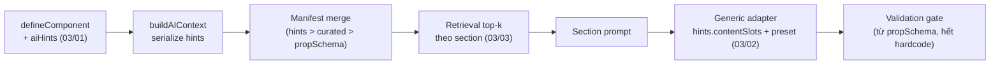

# 03 — Component Platform (scale số lượng & chủng loại component)

## Bài toán

Component sẽ tăng mạnh cả về số lượng lẫn chủng loại. Hiện tại việc "AI biết dùng một component" phụ thuộc
**3 chỗ hardcode ở server** — thêm component mới là phải sửa tay cả 3:

1. `CURATED_COMPONENT_CAPABILITIES` — `apps/api/src/services/component-capability-manifest.ts:21-179`
2. `candidateComponentsForSection` — `apps/api/src/services/component-contract-resolver.ts:156-169`
3. Adapter + `LEAF_COMPONENT_TYPES` + `REQUIRED_PROPS` + `hasValidEnumProps` — `section-plan-compiler.ts`

Đồng thời bộ component hiện tại **thiếu các khối bắt buộc của landing page**: không có Form/Input nào
(không thu lead được), không có Video, Icon, Tabs/Accordion container, Map, Countdown.

## Chiến lược tổng

**Component tự mô tả → server tổng hợp → retrieval khi prompt → generic adapter khi compile.**
Sau khi hoàn thành, thêm 1 component mới chỉ cần: viết `defineComponent` (kèm `aiHints`) — AI tự biết dùng,
không sửa dòng server nào.

## Hạng mục

| # | File | Nội dung | Phase | Trạng thái |
|---|------|----------|-------|-----------|
| 01 | [01-ai-hints.md](./01-ai-hints.md) | `aiHints` trong ComponentDefinition — nguồn sự thật duy nhất | P4 | ✅ Hoàn thành |
| 02 | [02-generic-adapter.md](./02-generic-adapter.md) | Generic adapter thay adapter hardcode per-component | P4 | Chưa bắt đầu |
| 03 | [03-component-retrieval.md](./03-component-retrieval.md) | Chọn top-k component cho prompt khi catalog lớn | P4 | Chưa bắt đầu |
| 04 | [04-form-primitives.md](./04-form-primitives.md) | Form, Input, Textarea, Select, Checkbox + submit pipeline | P5 | Chưa bắt đầu |
| 05 | [05-wave2-components.md](./05-wave2-components.md) | Video/Embed, Icon, Tabs, Accordion, Countdown, Map, LogoStrip | P5 | Chưa bắt đầu |
| 06 | [06-new-section-types.md](./06-new-section-types.md) | Section type mới: form/lead, video, logo-strip, team, contact | P5 | Chưa bắt đầu |

Thứ tự bắt buộc: 01 → 02 → 03 (nền), rồi 04 → 06 → 05 (04 là ưu tiên cao nhất trong nhóm mới vì
landing không thu lead là landing hỏng).

**01 hoàn thành 2026-07-21** (3 PR độc lập — chi tiết trong [01-ai-hints.md](./01-ai-hints.md)). Nền đã
sẵn sàng cho 02 (generic adapter dùng `aiHints.contentSlots`) và 03 (retrieval dùng `sectionAffinity`).
