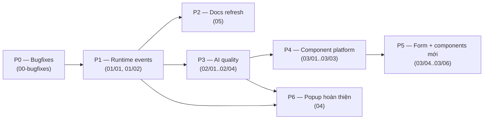

# Roadmap cải tiến & nâng cấp — My Builder

> Bộ roadmap này được lập từ kết quả audit toàn bộ source code ngày **2026-07-20** (đánh giá code trước, đối chiếu docs sau).
> Mỗi hạng mục là **một file riêng**, mô tả đầy đủ: mục đích, lý do, hiện trạng (kèm file:line), cách làm từng bước,
> hướng thiết kế, kết quả mong muốn (acceptance criteria), tình huống có thể xảy ra và corner case, rủi ro & rollback.

## Cấu trúc

| Thư mục | Nhóm | Nội dung chính |
|---------|------|----------------|
| [00-bugfixes/](./00-bugfixes/) | 🔴 Sửa lỗi | Các bug đã xác nhận trong code, sửa ngay, tác động lớn |
| [01-interactions-events/](./01-interactions-events/) | ⚡ Events | Hoàn thiện runtime action "chết", bổ sung trigger mới, nâng cấp UI, cho AI wire event |
| [02-ai-generation/](./02-ai-generation/) | 🤖 AI Generate | Preset-first compiler, content pack theo ngành, locale, quality gate, media, chi phí |
| [03-component-platform/](./03-component-platform/) | 🧩 Component | Chiến lược scale component (aiHints, generic adapter, retrieval), Form primitives, component & section type mới |
| [04-popup-modal/](./04-popup-modal/) | 🪟 Popup/Modal | Kéo thả vào popup, UX mở popup bằng event, exit-intent, AI tạo popup từ template |
| [05-docs-standardization/](./05-docs-standardization/) | 📚 Docs | Chuẩn hoá docs user (`/docs`) và docs AI (`.claude/docs`), quy tắc đồng bộ |
| [legacy/](./legacy/) | 🗄 Lưu trữ | Tài liệu planning cũ (upgrade plan v1, proposal v2) — giữ để tham khảo lịch sử |

## Thứ tự thực hiện đề xuất (phase)

| Phase | Hạng mục | Ước lượng | Điều kiện tiên quyết |
|-------|----------|-----------|----------------------|
| P0 | Toàn bộ `00-bugfixes` | 2–3 ngày | Không |
| P1 | `01/01-runtime-dead-actions`, `01/02-lifecycle-triggers` | 3–4 ngày | Không |
| P2 | `05-docs-standardization` | 2 ngày | P0 (để docs không mô tả lại bug) |
| P3 | `02/01-preset-first`, `02/02-content-packs`, `02/03-locale`, `02/04-quality-gates` | 5–7 ngày | P0 |
| P4 | `03/01-ai-hints`, `03/02-generic-adapter`, `03/03-retrieval` | 5–7 ngày | P3 |
| P5 | `03/04-form-primitives`, `03/05-wave2`, `03/06-section-types` | 7–10 ngày | P4 |
| P6 | Toàn bộ `04-popup-modal`, `01/03`, `01/04`, `01/05` | 6–8 ngày | P1 |

> Ước lượng tính theo người-ngày cho 1 dev quen codebase. Các phase P3/P4/P6 có thể chạy song song bởi người khác nhau
> vì đụng vùng code khác nhau (apps/api vs builder-renderer vs builder-editor).

## Quy ước trạng thái

Mỗi file hạng mục có header `Trạng thái:` với các giá trị: `Chưa bắt đầu` → `Đang làm` → `Chờ review` → `Hoàn thành`.
Khi bắt đầu làm một hạng mục, cập nhật trạng thái ngay trong file đó và ghi PR/commit liên quan vào cuối file.

## Nguyên tắc chung khi thực hiện

1. **Mọi thay đổi state đi qua Command pattern** — không mutate trực tiếp (ràng buộc kiến trúc của repo).
2. `builder-core` **không được thêm dependency React/DOM** — logic runtime DOM đặt ở `builder-renderer`/`builder-react`.
3. LLM chỉ đề xuất **intent**; command cuối cùng do code deterministic sinh ra và **phải qua validation gate**.
4. Sau mỗi hạng mục: chạy `pnpm test` + kiểm tra lại docs liên quan (rule trong CLAUDE.md), cập nhật `.claude/docs` nếu hành vi/API đổi.
5. Không xoá tính năng đang chạy khi chưa có migration path (đặc biệt popup schema đã tới V6 — luôn viết migration khi đổi schema).
