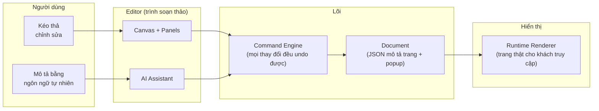

# 1. Giới thiệu tổng quan

## My Builder là gì?

My Builder là **thư viện xây dựng giao diện web bằng kéo-thả** (drag-and-drop UI builder), tập trung vào
landing page. Bạn ghép trang từ các khối có sẵn (component), chỉnh nội dung và giao diện trực tiếp trên
canvas, hoặc để **AI tạo cả trang** từ một câu mô tả — rồi xuất bản trang chạy thật.

Đây là library dạng monorepo — có thể nhúng editor và trình hiển thị (renderer) vào ứng dụng của bạn
(đã có sẵn các app mẫu: playground, CMS, website).

## Bức tranh tổng thể



Điểm quan trọng nhất của kiến trúc: **mọi thay đổi — kể cả do AI tạo ra — đều đi qua Command Engine**,
nghĩa là luôn hoàn tác (undo) được và luôn được kiểm tra hợp lệ trước khi vào trang.

## Tính năng chính

| Nhóm | Có gì |
|------|-------|
| **Soạn thảo** | Canvas kéo-thả, chỉnh text tại chỗ, responsive 3 breakpoint, dual-canvas, minimap, undo/redo, layers, đa chọn — [editor](./02-giao-dien-editor.md) |
| **Thuộc tính** | 5 tab: Design, Events, Effects, Data, Advanced cho mọi khía cạnh của phần tử — [property panel](./03-property-panel.md) |
| **Components** | 20+ khối: Text, Button, Image, layout (Section/Grid/Row/Column), Gallery nhiều kiểu, Navigation Menu, hiệu ứng chữ (marquee, mask), Shape… — [chi tiết](./04-components-va-preset.md) |
| **Preset** | Mẫu dựng sẵn cho từng component (heading đẹp, nav cổ điển…) — thả vào là dùng |
| **Styling & hiệu ứng** | 40+ bộ lọc ảnh, khung ảnh, đổ bóng, thư viện animation, hover effect — [chi tiết](./05-styling-va-hieu-ung.md) |
| **Media** | Media Manager (upload/URL/library), gallery nhiều layout, carousel — [chi tiết](./06-media-tai-nguyen.md) |
| **Popup** | Modal, drawer, bottom sheet, bar, fullscreen — kèm trigger tự động, A/B test, targeting, campaign — [chi tiết](./07-popup-modal.md) |
| **Sự kiện** | Gắn hành vi cho phần tử: click mở popup, cuộn tới section… — [chi tiết](./08-su-kien-interactions.md) |
| **AI** | Tạo cả trang từ mô tả, tạo từng section, chat chỉnh sửa, viết lại nội dung — [chi tiết](./09-ai-assistant.md) |
| **Import** | Nhập thiết kế từ Figma |
| **Runtime** | Render trang production (không kèm code editor), SSR-safe — [chi tiết](./11-runtime-va-tich-hop.md) |

## Cấu trúc dự án (nhìn nhanh)

```
packages/builder-core        ← lõi (document, command, registry) — không phụ thuộc React
packages/builder-components  ← các component dựng trang
packages/builder-editor      ← trình soạn thảo (canvas, panels, AI UI)
packages/builder-renderer    ← hiển thị trang thật
packages/builder-react       ← cầu nối React (hooks, provider)
packages/ui                  ← design system cho giao diện editor
apps/api                     ← backend AI (giữ API key, gọi LLM)
apps/playground | cms | website ← app demo/mẫu
```

## Đọc tiếp

- Bạn muốn dùng editor → [2. Giao diện Editor](./02-giao-dien-editor.md)
- Bạn muốn hiểu AI làm gì → [9. AI Assistant](./09-ai-assistant.md)
- Bạn là dev cần đặc tả → [.claude/docs](../../.claude/docs/README.md)
