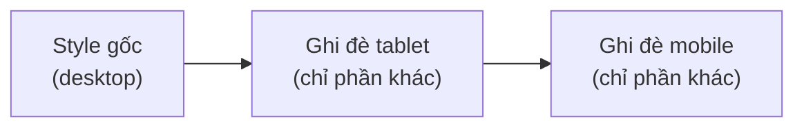

# 2. Giao diện Editor

## Bố cục màn hình

```
┌─────────────────────────────────────────────────────────────────┐
│  TOOLBAR: chọn/pan · undo/redo · breakpoint · zoom · grid ·      │
│           dual-canvas · Figma · AI ✨ · preview                   │
├──────────────┬────────────────────────────────────┬─────────────┤
│ TRÁI         │                                    │ PHẢI        │
│ · Add        │            CANVAS                   │ Property    │
│   Elements   │   (artboard theo breakpoint)       │ Panel:      │
│ · Components │   · overlay chọn/resize/rotate      │ Design ·    │
│ · Presets    │   · spacing overlay                 │ Events ·    │
│ · Popups     │   · minimap góc dưới                │ Effects ·   │
│              │                                    │ Data ·      │
│              │                                    │ Advanced    │
├──────────────┴────────────────────────────────────┴─────────────┤
│  BOTTOM: Layer Tree (cây phân cấp node)                          │
└─────────────────────────────────────────────────────────────────┘
```

Khi **không chọn phần tử nào**, panel phải hiển thị **Page Settings** (cài đặt trang: tên, kích thước
canvas, màu nền, biến, AI config). Khi **chọn một phần tử**, panel phải chuyển sang 5 tab thuộc tính
(xem [bài 3](./03-property-panel.md)).

## Panel trái — thêm phần tử

| Mục | Chức năng |
|-----|-----------|
| **Add Elements** | Danh mục nhanh các loại phần tử cơ bản |
| **Components** | Palette đầy đủ component (kéo thả vào canvas) |
| **Presets** | Mẫu dựng sẵn theo nhóm — heading đẹp, nav cổ điển, card… ([bài 4](./04-components-va-preset.md)) |
| **Popups** | Quản lý popup của trang ([bài 7](./07-popup-modal.md)) |

Palette có thể ở dạng **floating** (nổi, kéo di chuyển) để không chiếm chỗ.

## Canvas — thao tác cơ bản

| Việc | Cách làm |
|------|----------|
| Thêm component | Kéo từ palette thả vào canvas, hoặc click-to-add khi đang chọn vùng chứa |
| Chọn phần tử | Click; **Shift/Ctrl+Click** thêm/bớt vào nhóm chọn; click nền để bỏ chọn |
| Chọn theo vùng | Kéo chuột trên nền tạo khung (**rubber-band select**) để chọn nhiều phần tử |
| Sửa chữ | Double-click Text — sửa tại chỗ, có toolbar định dạng nổi lên ([bài 5](./05-styling-va-hieu-ung.md)) |
| Di chuyển | Kéo trên canvas; phần tử "flow" chèn theo vị trí, phần tử "absolute" đặt tự do |
| Đổi kích thước | Kéo các **handle** ở góc/cạnh khi phần tử được chọn |
| Xoay | Kéo handle xoay (rotate) phía trên phần tử |
| Chỉnh số bằng kéo | **Scrub**: kéo ngang trên ô số (padding, cỡ chữ…) để tăng/giảm |
| Sắp xếp z-index | Đưa lên trước / ra sau qua contextual toolbar hoặc phím tắt |
| Undo / Redo | Ctrl/Cmd+Z, Ctrl/Cmd+Shift+Z — mọi thao tác đều hoàn tác |

Đầy đủ phím tắt & cử chỉ chuột: [bài 10](./10-phim-tat-thao-tac.md).

## Overlay trên canvas

- **Selection overlay**: viền + handle resize/rotate quanh phần tử đang chọn.
- **Spacing overlay**: hiện margin/padding trực quan khi chỉnh khoảng cách.
- **Section overlay & toolbar**: công cụ riêng cho Section (thêm section, đổi nền, divider).
- **Contextual toolbar**: thanh công cụ nổi theo phần tử đang chọn (duplicate, delete, khoá, ẩn, z-index).
- **Multi-select toolbar**: khi chọn nhiều phần tử (duplicate/delete cả nhóm).

## Toolbar — công cụ chính

| Nhóm | Công cụ |
|------|---------|
| Chế độ con trỏ | **Select (V)** chọn phần tử · **Pan (H)** kéo canvas |
| Lịch sử | Undo (⌘Z) · Redo (⌘⇧Z) |
| Breakpoint | Desktop (D) · Tablet · Mobile (M) — kèm kích thước viewport |
| Zoom | Zoom out/in · **Fit to screen (⇧1)** |
| Hiển thị | Bật/tắt lưới (grid) · **Dual canvas** (xem 2 breakpoint cạnh nhau) |
| Nhập | **Import từ Figma** |
| AI | Nút ✨ mở AI Assistant ([bài 9](./09-ai-assistant.md)) |
| Xem thử | Preview |

## Responsive — 3 breakpoint

Chọn breakpoint trên toolbar rồi chỉnh; thay đổi ở breakpoint nhỏ chỉ ghi đè cho breakpoint đó, không phá
bản desktop. Có thể **ẩn phần tử theo breakpoint**. **Dual canvas** cho xem desktop + mobile song song để
so sánh.



## Layer Tree (panel dưới)

Cây phân cấp toàn bộ node của trang — chọn, đổi tên, ẩn/hiện, khoá, kéo sắp xếp lại thứ tự và cấp bậc.
Hữu ích khi phần tử bị chồng lấp khó click trên canvas.

## Minimap

Bản đồ thu nhỏ ở góc canvas — nhìn tổng thể trang dài và nhảy nhanh tới vùng cần chỉnh.

## Cấu trúc trang chuẩn

Trang xếp theo tầng: **Section** (dải ngang toàn trang) → vùng chứa (**Container / Grid / Row / Column**)
→ phần tử nội dung (**Text, Button, Image…**). Phần tử nội dung không nằm trực tiếp ở gốc trang — luôn
trong Section. Editor và AI đều tự tuân thủ.

## Import từ Figma

Toolbar → Figma import: dán link file Figma (cần token), chọn frame → builder chuyển thành component tree
để chỉnh tiếp.

> Chi tiết kỹ thuật cho dev: [.claude/docs/EDITOR_UI.md](../../.claude/docs/EDITOR_UI.md)
