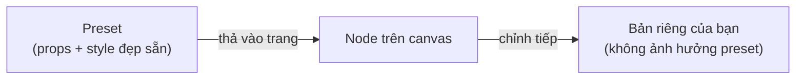

# 4. Components & Preset

## Component là gì?

Component là khối dựng trang — mỗi phần tử bạn kéo vào canvas là một component với bộ thuộc tính
(props) chỉnh được ở panel phải.

## Danh sách component hiện có

### Layout (vùng chứa)
| Component | Dùng cho |
|-----------|----------|
| **Section** | Dải ngang toàn trang — đơn vị lớn nhất, có nền/khoảng cách riêng, hỗ trợ divider trang trí |
| **Container** | Vùng chứa linh hoạt (flex) trong section |
| **Grid** | Lưới cột responsive — cards, pricing, gallery đơn giản |
| **Row / Column** | Xếp ngang / dọc nhanh |
| **Repeater** | Lặp một mẫu con nhiều lần |

### Nội dung
| Component | Dùng cho |
|-----------|----------|
| **Text** | Chữ rich-text (heading, đoạn văn, nhãn) |
| **Button** | Nút bấm / CTA |
| **Image** | Ảnh đơn (có filter, khung, focal point) |
| **Divider** | Đường kẻ phân cách |
| **Shape** | Hình trang trí (tròn, sao, tim, blob…) |
| **Anchor** | Điểm neo để menu/nút cuộn tới |

### Nâng cao
| Component | Dùng cho |
|-----------|----------|
| **NavigationMenu** | Menu điều hướng đầy đủ: ngang/dọc, submenu, hamburger mobile, nhiều kiểu item |
| **GalleryPro** | Bộ sưu tập ảnh nhiều layout: grid, masonry, collage, slider, slideshow, strip, stacked (+ các biến thể Honeycomb, 3D Carousel, Freestyle…) |
| **GalleryGrid / GallerySlider** | Gallery thế hệ trước (vẫn dùng tốt cho nhu cầu đơn giản) |
| **CollapsibleText** | Khối chữ thu gọn/mở rộng — FAQ, "xem thêm" |
| **TextMarquee** | Dòng chữ chạy ngang |
| **TextMask** | Chữ lớn đổ màu gradient/ảnh |

> **Sắp có** (xem [roadmap](../roadmap/03-component-platform/)): nhóm **Form** (Input, Select, Checkbox — thu lead),
> Video, Icon, Tabs/Accordion, Countdown, LogoStrip, Map.

## Preset & Palette

**Preset** = một component đã được cấu hình sẵn đẹp (ví dụ "Heading 1", "Classic Nav", "Card bo góc").
Palette bên trái nhóm các preset theo loại — thả preset vào trang là có ngay khối hoàn chỉnh, sau đó
chỉnh tự do. Bạn có thể đăng ký bộ preset riêng (PaletteCatalog) khi nhúng builder vào app của mình.

## Mở rộng component (cho dev)

- Dev tạo component mới bằng `defineComponent()` hoặc phái sinh từ component có sẵn bằng `extendComponent()`
  (các Gallery biến thể được tạo đúng theo cách này).
- Component đăng ký thêm sẽ tự xuất hiện trong Palette và được AI nhận biết.

> Đặc tả chi tiết: [.claude/docs/DATA_MODEL.md](../../.claude/docs/DATA_MODEL.md) (ComponentDefinition, PropSchema)
> và [.claude/docs/PRESETS.md](../../.claude/docs/PRESETS.md)
