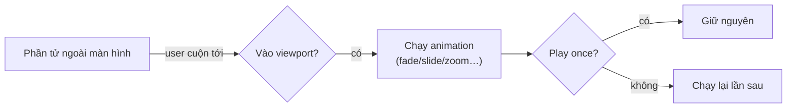

# 5. Styling & Hiệu ứng

Bài này gom các công cụ tạo phong cách và chuyển động: định dạng chữ, bộ lọc ảnh, khung ảnh, đổ bóng,
animation, hover — phần lớn nằm ở tab **Design** và **Effects** của [Property Panel](./03-property-panel.md).

## Định dạng chữ (Text)

Double-click vào Text để sửa tại chỗ; một **toolbar định dạng nổi** xuất hiện với: đậm, nghiêng, gạch chân,
gạch ngang, màu chữ, tô nền (highlight), cỡ chữ, căn lề, danh sách, chèn link. Ngoài ra tab Design →
Typography cho chỉnh font family, độ đậm, line-height, letter-spacing ở mức toàn phần tử.

## Bộ lọc ảnh (Image Filters)

Chọn Image → tab Design → **Filter**: hơn **40 bộ lọc** kiểu Instagram, chia chế độ CSS / SVG / overlay.
Vài ví dụ: *Kennedy, Darken, Faded, Gotham, Nightrain, Whistler, Soledad, Manhattan, Neon Sky, Neptune…*
Mỗi bộ lọc có ô preview để so sánh trước khi áp.

## Khung ảnh (Image Frames)

Chọn Image → panel khung ảnh: các kiểu viền dựng sẵn (Thin/Medium/Thick Black, White, Gray, **Dashed,
Dotted, Double, Rounded**…) và các khung đặc biệt. Áp một click, chỉnh màu/độ dày sau.

## Đổ bóng (Shadow)

Tab Design → **Shadow** cho khối và **Text Shadow** cho chữ:

- Chọn nhanh preset: *Soft, Medium, Hard, Deep, Offset, Spread, Glow White, Glow Blue…*
- Hoặc chỉnh thủ công qua control chuyên dụng: **góc** (angle picker), khoảng cách, độ mờ (blur), spread, màu.

## Animation khi xuất hiện

Tab **Effects** → **Display Animation**: hiệu ứng chạy khi phần tử cuộn vào màn hình. Thư viện phong phú
theo nhóm:

| Nhóm | Ví dụ |
|------|-------|
| **Attention** | Bounce, Flash, Pulse, Rubber Band, Shake, Swing, Tada, Wobble, Jello, Heart Beat |
| **Fade In / Out** | Fade In (Down/Up/Left/Right/Top-Left…), Fade Out |
| **Bounce In / Zoom In** | Bounce In, Zoom In (theo hướng) |
| **Slide In / Rotate In** | Slide, Rotate theo hướng |
| **Flip / Special / Exit** | Flip, hiệu ứng đặc biệt, hiệu ứng thoát |

Chỉnh được **thời lượng, delay, easing** (Ease, Linear, Smooth…), và **chạy một lần** hay lặp mỗi lần vào
viewport. Có nút **xem thử** ngay trong panel.

## Hover Effect

Tab Effects → **Hover Effect**: biến đổi khi rê chuột — transform (phóng nhẹ/dịch chuyển), opacity, shadow.
Đây là hover **về mặt style**, không cần dùng tab Events. (Hover kích hoạt hành vi phức tạp thì dùng
[Events](./08-su-kien-interactions.md).)

## Transform & Visual

Tab Design → **Transform** (xoay, scale, translate, skew) và **Visual** (opacity, overflow, blend mode,
cursor, z-index) cho các tinh chỉnh nâng cao về hiển thị.

## Màu sắc & Gradient

Mọi ô màu dùng **Color Picker** chung: chọn màu, độ trong suốt, và **gradient** (nơi cho phép). Có swatch
lưu màu để tái sử dụng nhanh.

> Đặc tả kỹ thuật: [.claude/docs/IMAGE_FILTERS.md](../../.claude/docs/IMAGE_FILTERS.md) (bộ lọc) và
> phần Effects trong [.claude/docs/PROPERTY_SYSTEM.md](../../.claude/docs/PROPERTY_SYSTEM.md).
