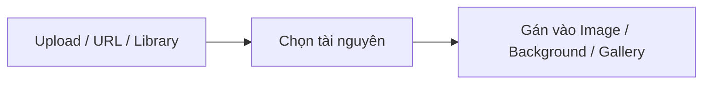

# 6. Media & Tài nguyên

Bài này về ảnh/video và các công cụ liên quan: quản lý tài nguyên, cấu hình gallery và carousel.

## Media Manager

Mở khi chọn ảnh/video (nút chọn media). Dialog gồm **3 tab**:

| Tab | Chức năng |
|-----|-----------|
| **Library** | Duyệt các tài nguyên đã có, tìm kiếm |
| **Upload** | Kéo-thả nhiều file để tải lên — có thanh tiến trình từng file (pending → uploading → done/error), tải xong tự chuyển về Library để thấy ngay |
| **URL** | Dán link ảnh/video từ bên ngoài |

Nơi lưu tài nguyên (backend upload) do ứng dụng nhúng builder cấu hình — builder cung cấp giao diện, bạn
cắm nguồn lưu trữ của mình.

## Gallery — cấu hình

**GalleryPro** hỗ trợ nhiều layout, chuyển đổi ngay trong panel cài đặt gallery:

| Nhóm layout | Kiểu |
|-------------|------|
| Cơ bản | Grid, Masonry, Collage, Strip, Stacked |
| Carousel | Slider, Slideshow, 3D Carousel |
| Đặc biệt | Honeycomb (+ Diamond, Triangle), Freestyle |

Panel cài đặt gallery (Design) đổi theo layout đang chọn: số cột, khoảng cách (gap), tỉ lệ ảnh
(aspect ratio), bo góc, cách fit ảnh, và **lightbox** khi click ảnh. Với Honeycomb/Freestyle có tùy chọn
riêng cho từng kiểu.

Ngoài GalleryPro còn **GalleryGrid** và **GallerySlider** (thế hệ trước) cho nhu cầu đơn giản.

## Carousel — cấu hình

Với các layout dạng trượt (slider/slideshow/3D), panel carousel cho chỉnh:

| Nhóm | Tùy chọn |
|------|----------|
| **Slides** | Slides per view, slides per group, khoảng cách, bo góc slide, centered slides |
| **Loop & Effect** | Loop / Rewind / Off, hiệu ứng chuyển (slide, fade, cube…), click-to-slide |
| **Navigation** | Mũi tên điều hướng |
| **Pagination** | Chấm chỉ báo, khoảng cách bullet |
| **Autoplay** | Bật/tắt, delay, dừng khi kéo, tạm dừng khi hover, đảo chiều |

## Ảnh nền

Ngoài component Image, mọi phần tử có thể đặt **ảnh nền** (tab Design → Background): chọn ảnh, kích thước
(cover/contain/…), vị trí, kiểu lặp — kết hợp với màu/gradient nền.

> Đặc tả kỹ thuật: [.claude/docs/MEDIA_MANAGEMENT.md](../../.claude/docs/MEDIA_MANAGEMENT.md).
> Các bug/cải tiến gallery của AI: xem [roadmap 00/01](../roadmap/00-bugfixes/01-pet-image-leak.md).
