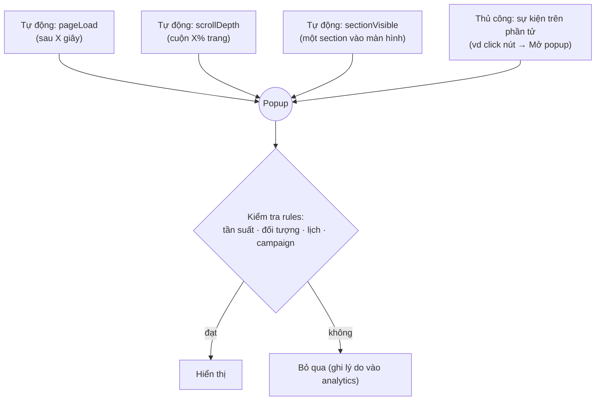

# 7. Popup / Modal

My Builder có hệ popup hoàn chỉnh — popup là **lớp riêng của tài liệu** (không phải phần tử nằm trong trang),
được quản lý ở panel Popups và hiển thị đè lên trang khi được kích hoạt.

## 5 kiểu popup

| Kiểu | Hình dung | Dùng cho |
|------|-----------|----------|
| **Modal** | Hộp giữa màn hình + nền mờ | Thông báo, ưu đãi, xác nhận |
| **Drawer** | Trượt từ cạnh trái/phải | Menu phụ, giỏ hàng, form dài |
| **Bottom Sheet** | Trượt từ đáy, kéo theo nấc (snap) | Mobile-first: bộ lọc, chi tiết nhanh |
| **Bar** | Thanh dính trên/dưới trang | Thông báo cookie, khuyến mãi |
| **Fullscreen** | Phủ toàn màn hình | Menu mobile, chào mừng |

Mỗi popup có cấu hình riêng: kích thước, vị trí, animation vào/ra, backdrop (màu/mờ/blur),
đóng bằng Esc/click nền, khoá cuộn trang, giữ focus (accessibility)…

## Popup mở khi nào?

- Cách gắn "click nút → mở popup": chọn nút → tab **Events** → trigger Click → action **showModal** → chọn popup.
  (Xem [bài 8](./08-su-kien-interactions.md).)
- **Sắp có**: trigger exit-intent (sắp rời trang) và idle (đứng im lâu) — [roadmap](../roadmap/04-popup-modal/03-exit-intent-idle.md).

## Chỉnh sửa nội dung popup

Vào panel Popups → chọn popup → canvas chuyển sang chế độ chỉnh popup (trang mờ phía sau).
Bạn chọn **shell** (khung popup — kích thước, vị trí) hoặc **content** (nội dung bên trong) để chỉnh.
Có thư viện **template popup** dựng sẵn để bắt đầu nhanh.

> Lưu ý: kéo-thả component mới từ Palette vào popup đang được hoàn thiện —
> xem [roadmap 04/01](../roadmap/04-popup-modal/01-dragdrop-into-popup.md). Hiện chỉnh sửa node có sẵn trong template hoạt động đầy đủ.

## Tính năng nâng cao (marketing)

| Tính năng | Mô tả |
|-----------|-------|
| **Goals** | Đo chuyển đổi: click nút nào đó, submit, sự kiện tuỳ chỉnh, ghé URL |
| **A/B Variants** | Nhiều phiên bản nội dung, chia theo trọng số, chọn winner |
| **Targeting** | Chỉ hiện cho đối tượng thoả điều kiện (user trait, URL, giờ, số lần ghé…) |
| **Scheduling** | Hẹn khung ngày/giờ/thứ hiển thị |
| **Frequency capping** | Giới hạn số lần hiện (theo session/ngày/tuần…) |
| **Locales** | Nội dung theo ngôn ngữ người xem |
| **Campaigns** | Gom popup thành chiến dịch: trạng thái draft→published, phân xử khi nhiều popup cùng muốn mở (queue/suppress/replace) |
| **Analytics** | Chuỗi sự kiện chuẩn (impression, open, close, cta_click, conversion…) đẩy về hệ thống của bạn |

> Đặc tả kỹ thuật popup cho dev: sẽ có tại `.claude/docs/POPUPS.md`
> ([roadmap 05/02](../roadmap/05-docs-standardization/02-ai-docs-refresh.md)); tạm thời xem trực tiếp
> `packages/builder-core/src/document/popups.ts`.
