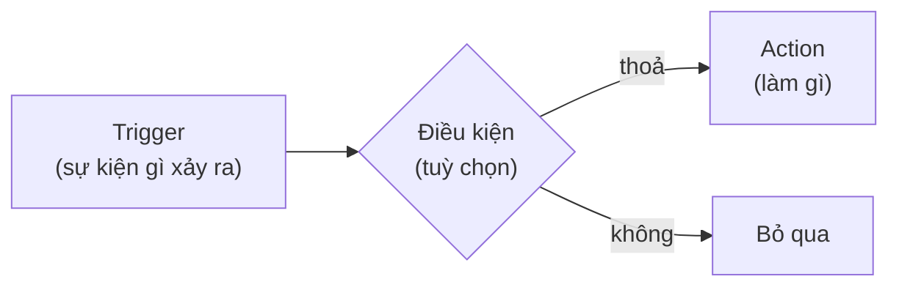

# 8. Sự kiện & Interactions

Interactions cho phần tử **phản ứng với người dùng**: bấm nút mở popup, cuộn tới section, đổi trạng thái…
Cấu hình tại panel phải → tab **Events** (chọn phần tử trước).

## Mô hình: Trigger → (Điều kiện) → Action

Ví dụ phổ biến nhất: **Trigger = Click** trên Button, **Action = showModal** (mở popup đã chọn).

## Trigger đang dùng được

| Trigger | Khi nào bắn |
|---------|-------------|
| click / dblclick | Bấm / bấm đúp |
| hover / mouseenter / mouseleave | Chuột vào / rời phần tử |
| focus / blur | Phần tử nhận / mất focus |
| submit / change | Gửi form / thay đổi giá trị (dành cho form components sắp có) |
| scroll | Cuộn bên trong phần tử |

## Action đang dùng được

| Action | Làm gì |
|--------|--------|
| **navigate** | Mở URL (cùng tab / tab mới) |
| **showModal / hideModal** | Mở / đóng popup — cách chuẩn để bật modal, drawer, bottom sheet |
| **setState** | Đặt biến trạng thái (dùng làm điều kiện cho interaction khác) |

## Đang hoàn thiện (đã có trong giao diện, runtime đang được bổ sung)

Một số lựa chọn đã xuất hiện trong tab Events nhưng phần thực thi ở trang thật đang được hoàn thiện —
**tránh dựa vào chúng cho trang production** cho tới khi roadmap tương ứng hoàn thành
([roadmap 01/01](../roadmap/01-interactions-events/01-runtime-dead-actions.md) và [01/02](../roadmap/01-interactions-events/02-lifecycle-triggers.md)):

- Action: `scrollTo` (cuộn tới phần tử), `toggleVisibility` (ẩn/hiện), `addClass`/`removeClass`,
  `triggerApi` (gọi API), `emit`, `custom`.
- Trigger: `mount`, `unmount` (xuất hiện/biến mất), `intersect` (vào viewport).

Kế hoạch mở rộng tiếp theo (trigger chuột chi tiết mousedown/mouseover…, long-press, exit-intent, delay,
multi-action, condition builder, chọn target bằng picker): xem [roadmap nhóm 01](../roadmap/01-interactions-events/README.md).

## Mẹo & lưu ý

- Interactions **chỉ chạy ở Preview và trang thật** — trong lúc chỉnh sửa, click dùng để chọn phần tử.
- Muốn menu/nút cuộn tới một section: dùng **NavigationMenu** với target kiểu anchor, hoặc đặt component
  **Anchor** vào vị trí đích.
- Hiệu ứng hover đơn giản về style (nổi bóng, phóng nhẹ) có sẵn trong tab Style (hover transform/opacity/shadow)
  — không cần dùng Events.

> Đặc tả kỹ thuật: `packages/builder-core/src/document/interactions.ts` (contract) và
> [.claude/docs/RUNTIME.md](../../.claude/docs/RUNTIME.md) (cách runtime gắn sự kiện).
