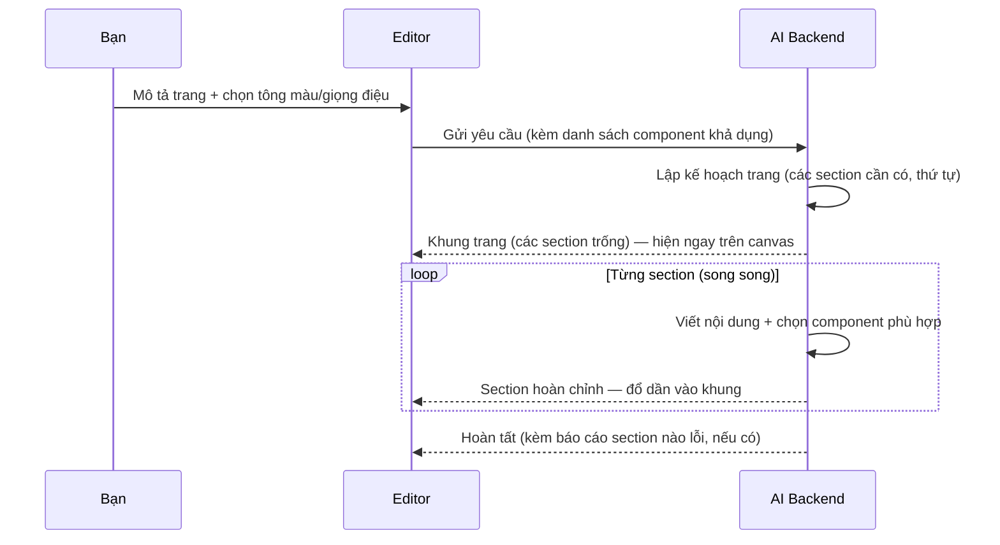

# 9. AI Assistant

Builder có lớp AI tích hợp giúp bạn tạo và chỉnh trang bằng ngôn ngữ tự nhiên (Việt hoặc Anh).
Mọi thứ AI làm đều là các thao tác builder chuẩn — **luôn undo được**, và luôn được kiểm tra hợp lệ trước khi vào trang.

## 3 cách dùng AI

| Cách | Mở ở đâu | Dùng khi |
|------|----------|----------|
| **Tạo cả trang** (Page Generator) | Nút ✨ trên toolbar → bật "Generate full page" | Bắt đầu từ trang trắng: "Landing page cho spa thú cưng ở Hà Nội" |
| **Tạo/viết lại một section** | Chuột phải section → biểu tượng AI | Thêm nhanh Hero/FAQ/Pricing… hoặc làm mới một section |
| **Chat chỉnh sửa** | Nút ✨ (chế độ chat) | Sửa có mục tiêu: "đổi nút CTA sang màu đỏ, chữ to hơn" |

Ngoài ra còn **AI Tools** cho chữ: viết lại nội dung, đổi giọng điệu (thân thiện, trang trọng, hài hước…).

## Tạo cả trang hoạt động thế nào?

Bạn không cần hiểu chi tiết để dùng — nhưng biết luồng sẽ giúp bạn hiểu vì sao trang hiện dần từng phần:



Điểm hay của thiết kế: AI chỉ đề xuất **ý định và nội dung**; phần dựng cấu trúc do code kiểm soát —
nên trang luôn đúng cấu trúc (Section → vùng chứa → nội dung), đúng component, không bao giờ "vỡ".
Nếu một section lỗi (mạng, AI quá tải), hệ thống tự thay bằng nội dung dự phòng — trang không bao giờ trống.

## Bạn điều khiển được gì?

- **Tông màu** (palette) và **giọng điệu** (tone) — chọn trong dialog trước khi generate; AI phải tuân theo.
- **Full page mode**: bật = xoá nội dung cũ và thay bằng trang mới (undo được); tắt = chỉ thêm/sửa.
- **Design tokens** (màu thương hiệu, font) trong cài đặt AI — áp cho mọi lần generate.

## Giới hạn hiện tại (thành thật)

- Chat hiện xử lý **từng yêu cầu một** (chưa nhớ hội thoại dài) — cải tiến tại [roadmap 00/04](../roadmap/00-bugfixes/04-chat-history.md).
- AI **chưa tạo được popup** và chưa gắn sự kiện thành thạo — kế hoạch tại
  [roadmap 04/04](../roadmap/04-popup-modal/04-ai-popup-generation.md) và [01/05](../roadmap/01-interactions-events/05-ai-event-wiring.md).
- Ảnh trong trang generate là ảnh minh hoạ mặc định — tích hợp tìm ảnh theo ngữ cảnh tại [roadmap 02/06](../roadmap/02-ai-generation/06-media-pipeline.md).

## Cài đặt (một lần, cho dev/admin)

AI cần backend `apps/api` chạy kèm (giữ API key an toàn phía server):

```bash
cd apps/api
LLM_PROVIDER=claude LLM_API_KEY=sk-... pnpm dev   # hoặc openai / gemini
```

Trong editor: Page Settings → AI → điền Backend URL (mặc định `http://localhost:3002`).

> Đặc tả chi tiết pipeline, sự kiện SSE, validation, biến môi trường:
> [.claude/docs/AI_ASSISTANT.md](../../.claude/docs/AI_ASSISTANT.md)
