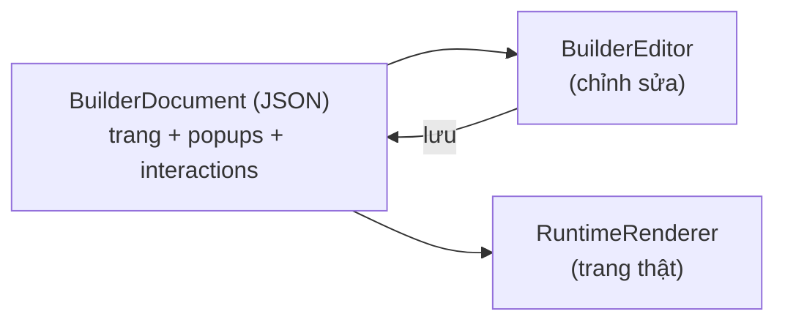

# 11. Runtime & Tích hợp

## Editor ≠ Runtime

Hai chế độ hiển thị tách biệt hoàn toàn:

- **Editor** (`builder-editor`): canvas chỉnh sửa — overlay chọn phần tử, kéo thả, không chạy interactions.
- **Runtime** (`builder-renderer`): trang thật cho khách truy cập — nhẹ, không chứa code editor,
  chạy interactions + popup + animation, hỗ trợ SSR.



Dữ liệu trung tâm là **BuilderDocument** — một JSON mô tả toàn bộ trang. Bạn lưu nó ở đâu tuỳ bạn
(database, file, CMS). Editor xuất ra document; runtime nhận document và render.

## Nhúng runtime vào ứng dụng (tóm tắt cho dev)

```tsx
import { RuntimeRenderer } from "@ui-builder/builder-renderer";
import { createRegistryWithBuiltins } from "@ui-builder/builder-components";

<RuntimeRenderer
  document={savedDocument}
  registry={registry}
  config={{
    breakpoint: "auto",
    popupContext: { user: {...}, page: {...} },   // dữ liệu cho popup targeting
    onPopupAnalytics: (event) => track(event),     // nhận chuỗi sự kiện popup
  }}
/>
```

Những gì runtime tự lo:

| Việc | Ghi chú |
|------|---------|
| Responsive | Áp style theo breakpoint của thiết bị |
| Interactions | Gắn sự kiện đã cấu hình trong Events tab |
| Popup | Auto-trigger, stack, frequency/targeting/schedule, campaign arbitration, focus trap, khoá scroll |
| Animation | Hiệu ứng xuất hiện khi cuộn (IntersectionObserver), hover effects |
| SSR | Render phía server an toàn (không đụng DOM khi chưa hydrate) |

## Popup analytics

Runtime phát chuỗi sự kiện chuẩn (impression, open, close, cta_click, submit, conversion,
variant_assigned, rules_blocked…) qua callback — bạn tự nối vào GA/Amplitude/hệ thống riêng.
Sự kiện có đủ popupId, variantId, lý do đóng, lý do bị chặn.

## Các app mẫu trong repo

| App | Vai trò |
|-----|---------|
| `apps/playground` | Sân thử editor đầy đủ tính năng |
| `apps/cms` | Ví dụ nhúng builder vào CMS |
| `apps/website` | Ví dụ render trang đã build (Next.js) |
| `apps/api` | Backend AI + palette + media + popup templates |

> Đặc tả chi tiết: [.claude/docs/RUNTIME.md](../../.claude/docs/RUNTIME.md) và
> [.claude/docs/INTEGRATION.md](../../.claude/docs/INTEGRATION.md)
